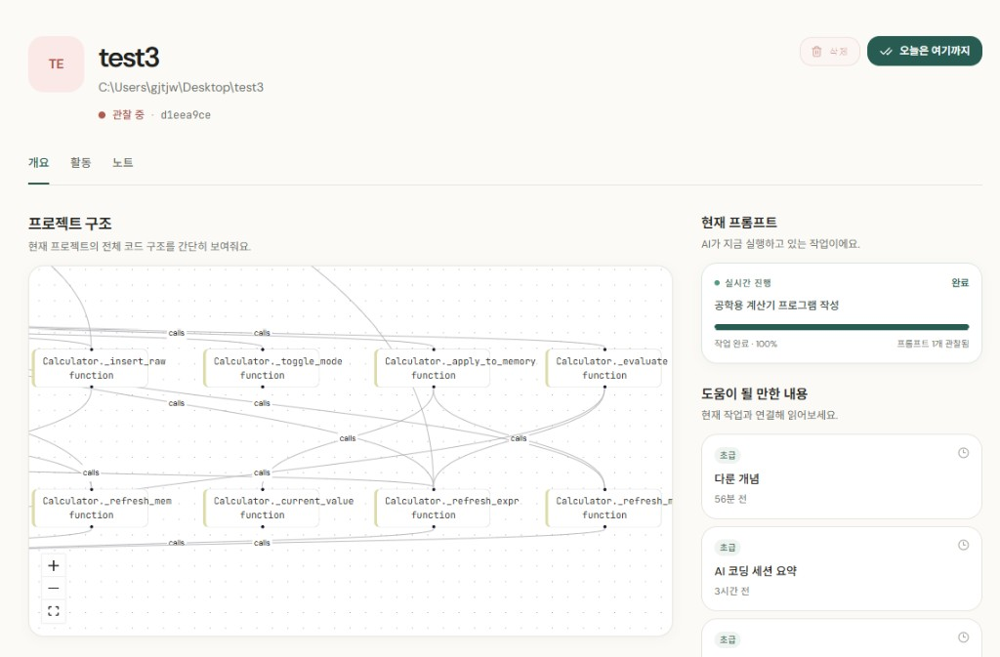
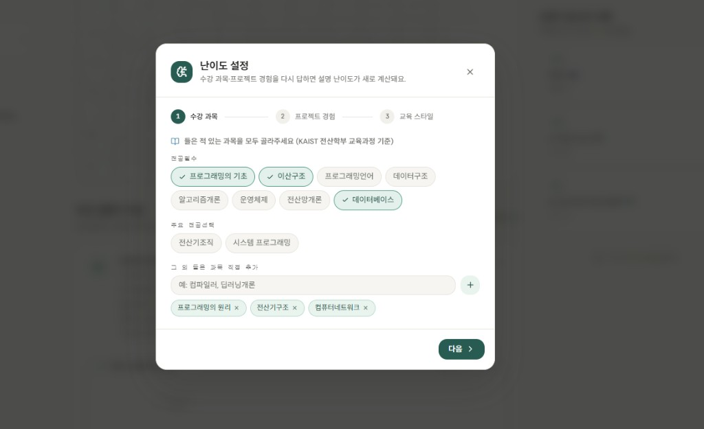
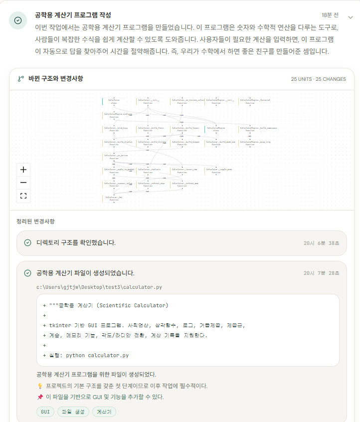

# 26s-w2-c1-06

## 공통과제 II : 협업형 실전 산출물 제작 (2인 1팀)

**목적:** 실시간 인터랙션, LLM Wrapper, Cross-Platform 중 하나의 옵션을 선택해 구현하며, 선택한 기술을 실제로 동작하는 형태의 산출물로 완성한다.

**선택 옵션:**

| 옵션 | 설명 |
|---|---|
| 실시간 인터랙션 | 사용자 간 상태 변화, 실시간 데이터 흐름, 스트리밍 응답 등 실시간성이 드러나는 기능을 구현 |
| LLM Wrapper | LLM API를 활용하여 AI 기능이 포함된 산출물을 구현 |
| Cross-Platform | 하나의 산출물을 여러 실행 환경에서 사용할 수 있도록 구현* |

> *데스크톱 앱 ↔ 모바일 앱; 혹은 다른 폼팩터에서의 앱; 웹만/웹 기반 프레임워크(Electron, Tauri 등) 대신 다른 프레임워크를 시도해보는 것을 적극 권장

**결과물:** 선택한 옵션이 적용된 작동 가능한 산출물, 실행 가능한 코드, 시연 자료 및 관련 문서

---

## 팀원

| 이름 | 학교 | GitHub | 역할 |
|---|---|---|---|
| 유영석 | KAIST | github.com/yskstuff | 개발자 |
| 허서준 | 서강대학교 | github.com/gjtjwns06-ui | 개발자 |

---

## 선택 옵션

- [ ] 실시간 인터랙션
- [x] LLM Wrapper
- [ ] Cross-Platform

---

## 기획안

- **산출물 주제:** Factcoding — Vibecoding(AI 코딩 에이전트를 활용한 개발) 과정을 실시간으로 관찰·해설하고, 세션 종료 후 복습 가능한 학습 자료로 정리해주는 데스크톱 앱
- **제작 목적:** Claude Code 같은 AI 코딩 에이전트가 대신 작업을 해줄수록 "내 코드가 왜 이렇게 바뀌었는지" 이해할 기회가 줄어든다. 에이전트의 작업 과정(무엇을 읽고, 어떤 코드를 만들고 고쳤는지)을 실시간으로 관찰해 LLM이 그 자리에서 설명해주고, 세션이 끝나면 배운 내용을 강의노트로 남겨 vibecoding을 학습 경험으로 바꾸는 것이 목적
- **선택 옵션:** LLM Wrapper — OpenAI API(gpt-4o-mini 계열, 실패 시 Gemini로 폴백)를 감싸 턴/스텝/코드 유닛 단위 실시간 해설, 세션 강의노트 합성, 세션 컨텍스트 기반 Q&A까지 여러 LLM 기능을 하나의 파이프라인으로 제공
- **핵심 구현 요소:**
  - Claude Code 세션 로그(JSONL)를 실시간 tail하고, tree-sitter로 AST를 파싱해 함수/클래스/컴포넌트 단위 코드 변경(diff)을 결정론적으로 추출
  - 그 변경 이벤트를 LLM에 배치로 넘겨 "지금 무슨 작업을 했는지" 실시간 해설 생성 — AI는 코드를 다시 타이핑하지 않고, 이미 결정론적으로 추출된 diff/핵심 코드 범위만 보고 설명만 채움
  - 사용자가 고른 난이도(온보딩 기반 자동 추정 + 슬라이더 재조정)에 맞춰 같은 사건도 설명 톤을 다르게 생성, 세션 종료 시 강의노트 자동 합성 + 세션 컨텍스트 기반 Q&A 챗
- **사용 / 시연 시나리오:** 사용자가 프로젝트를 등록하고 "시작하기"를 누른 뒤 평소처럼 Claude Code로 코딩을 진행하면, Factcoding이 별도 조작 없이 그 세션을 관찰해 실시간 진행 로그(스텝 카드)와 구조도를 채워나간다. 각 카드를 펼치면 그 스텝에서 실제로 생성/수정된 코드와 AI가 고른 핵심 부분을 확인할 수 있고, "완료"를 누르면 세션 전체를 요약한 강의노트가 자동으로 생성된다.
- **팀원별 역할:** 관찰 파이프라인(JSONL tail, 파일 스냅샷 캐시, AST diff 엔진, Claude Code 훅 자동 설치)과 AI 처리 레이어 + Electron/React UI(실시간 트레이스·구조도·강의노트·Q&A 화면, LLM 프로바이더 통합)로 역할을 나눠 각자 담당 레이어를 구현한 뒤 통합

### 개발 일정

| 날짜 | 목표 |
|---|---|
| Day 1 | 주제 확정 및 기술 명세(SPEC.md) 작성, 레포·개발 환경 세팅 |
| Day 2 | 아키텍처/DB 스키마 설계, 역할 분담(관찰 파이프라인 vs AI+UI) 확정 |
| Day 3 | 관찰 파이프라인(JSONL tail, 스냅샷 캐시, AST diff 엔진) 및 AI 처리 레이어·Electron/React UI 뼈대 구현, 두 레이어 통합 |
| Day 4 | 모니터링 시작/완료 플로우, 세션 목록, 실시간 진행 패널 프로토타이핑 및 UX 방향 검증 |
| Day 5 | 실시간 스텝 단위 진행 로그(유휴시간/개수 기반 그룹핑, 실제 diff 스니펫, 3단 구조 설명) 도입, 라이브 상태/실패 추적 |
| Day 6 | 프로젝트 워크스페이스 UI 전면 개편(사이드바+개요/활동/노트 3탭), OpenAI 프로바이더 최초 도입, Stop 훅 기반 턴 완료 신호와 진행바 |
| Day 7 | OpenAI 전환 마무리 및 실시간 진행 로그·코드 유닛 카드 타임라인 통합, 다국어(Python/Go/Java) 구조도 지원, 최종 정리 및 PR 머지 |

---

## 구현 명세서

| 구현 요소 | 설명 | 우선순위 |
|---|---|---|
| 세션 관찰 파이프라인 | Claude Code 세션 JSONL을 실시간 tail하고 훅을 자동 설치해 세션 시작/종료·턴 완료 시점을 확정적으로 기록 | 필수 |
| AST 기반 코드 구조도 | tree-sitter로 함수/클래스/컴포넌트 단위 변경을 결정론적으로 추출해 구조도(노드/엣지)와 diff로 축적 | 필수 |
| 실시간 LLM 해설 | 턴/스텝/코드 유닛 단위로 OpenAI API를 호출해 "지금 무슨 작업을 했는지" 실시간 카드로 노출, 난이도별 톤 조절 | 필수 |
| 강의노트 자동 합성 | 세션을 사용자가 명시적으로 "완료"하면 전체 트레이스를 LLM에 넘겨 복습용 Markdown 강의노트를 생성 | 필수 |
| 세션 Q&A 챗 | 지금까지 관찰된 구조/이력을 컨텍스트로 넘겨 사용자의 질문에 LLM이 답변 | 선택 |
| 핵심 코드 자동 선별 | LLM이 diff의 줄 번호만 골라주면 그 범위를 원문 그대로 잘라 보여줘, AI가 코드를 재작성하지 않고도 "핵심 부분"만 표시 | 선택 |
| 다국어 구조도 | tree-sitter grammar를 확장해 JS/TS 외 Python·Go·Java 코드베이스도 구조도로 시각화 | 선택 |

---

## 아키텍처

```
┌─────────────────────────────────────────────────────────────┐
│                     Factcoding Desktop App (Electron)         │
│                                                                 │
│  ┌───────────────┐   ┌──────────────────┐   ┌──────────────┐ │
│  │ Observation   │──▶│ AST Diff Engine  │──▶│ SQLite Store │ │
│  │ Layer         │   │ (tree-sitter)    │   │              │ │
│  │ (JSONL tail)  │   └──────────────────┘   └──────┬───────┘ │
│  └───────────────┘                                  │         │
│         │                                            │         │
│         ▼                                            ▼         │
│  ┌───────────────┐                          ┌──────────────┐  │
│  │ AI Processing │──────────────────────────│ React UI     │  │
│  │ Layer         │  (배치된 이벤트/질의)      │ (실시간 트레이스,│ │
│  │ OpenAI(+Gemini│──────────────────────────▶│  타임라인,구조도)│ │
│  │  폴백)        │   (해설/강의노트/답변)     └──────────────┘  │
│  └───────────────┘                                              │
└─────────────────────────────────────────────────────────────┘
         ▲
         │ 읽기 전용 tail
┌────────┴─────────┐
│ ~/.claude/projects/<hash>/*.jsonl   (사용자가 이미 실행 중인 Claude Code 세션) │
└───────────────────┘
```

- **Observation Layer** — 대상 프로젝트의 `.claude/settings.json`에 SessionStart/SessionEnd/Stop 훅을 자동 등록하고, Claude Code가 남기는 JSONL 트랜스크립트를 append-only로 가정해 byte offset 기준 증분 tail한다. Edit/Write 이벤트는 AST Diff Engine으로, 나머지는 `tool_events`/`prompts` 테이블로 바로 기록된다.
- **AST Diff Engine** — 파일 전체 내용을 인메모리 스냅샷으로 유지하면서 Edit의 `old_string→new_string`을 메모리에서 직접 치환(디스크 재조회 없음)하고, tree-sitter로 before/after를 각각 파싱해 함수/클래스/컴포넌트 단위로 `created`/`modified`/`deleted`를 판정한다. 호출/렌더 관계는 같은 패스에서 엣지로 함께 추출한다.
- **AI Processing Layer** — 공통 `AIProvider` 인터페이스 뒤에서 OpenAI를 우선 사용하고(모델 폴백 체인 포함), 키가 없으면 Gemini, 그마저 없으면 네트워크 호출 없는 Mock으로 자동 전환한다. 턴 캡션/스텝 요약/코드 유닛 해설/강의노트/Q&A 다섯 가지 용도를 모두 이 인터페이스로 호출한다.
- **React UI** — Electron IPC를 통해 메인 프로세스가 DB 변경 시마다 `data-changed` 이벤트를 push해, 렌더러가 폴링 대신 즉시 갱신된다. 실시간 진행 로그(스텝 카드)와 코드 유닛 카드를 하나의 타임라인으로 합쳐 보여준다.

---

## 설계 문서

> 프로젝트 성격에 따라 필요한 항목만 작성

### 화면 / 인터페이스 설계

사이드바에 등록된 프로젝트 목록을 두고, 프로젝트를 선택하면 **개요 / 활동 / 노트** 3개 탭으로 구성된 워크스페이스가 열린다.

- **개요**: 프로젝트 구조 미니 그래프, "직전 실행의 과정"(완료된 프롬프트별 AI 요약), 현재 진행 상태 카드
- **활동**: 실시간 진행 로그(스텝 카드 + 그 스텝에서 나온 코드 유닛 카드가 접고 펼 수 있게 중첩), 프롬프트 타임라인, 전체 구조도, 유닛별 코드 타임라인
- **노트**: 세션 종료 후 자동 합성된 강의노트 뷰어(난이도별 재생성 가능)

별도 Figma 산출물 대신 실제 Electron 앱 화면으로 반복 검증했다(`.claude/skills/verify/` 참고 — 개발 중 임시 스크린샷 캡처로 UI를 확인).

### 데이터 구조

로컬 SQLite(`better-sqlite3`, WAL 모드, `db/schema.sql`)에 아래 테이블로 저장한다.

| 테이블 | 용도 |
|---|---|
| `projects` | 관찰 대상 코드베이스(이름 + 워크스페이스 경로) |
| `sessions` | Claude Code 세션 단위. `started_at`/`ended_at`은 훅이, `completed_at`은 사용자의 "완료" 버튼 클릭만 기록 |
| `prompts` | 턴(사용자 요청) 단위. `completed_at`은 Stop 훅으로 즉시 채워져 진행중 스피너/진행바의 근거가 됨 |
| `tool_events` | 에이전트가 실행한 개별 도구 호출(Edit/Write/Bash 등) |
| `assistant_notes` | 에이전트가 남긴 서술 텍스트 조각(진행 로그 카드의 참고 텍스트) |
| `code_units` / `code_unit_versions` / `code_unit_edges` | AST로 추출한 함수/클래스/컴포넌트와 버전별 diff, import/calls/renders 관계 |
| `ai_explanations` | (target_type, target_id, skill_level) 단위로 캐시되는 LLM 해설 — 턴/스텝/코드 유닛/Q&A 공용 |
| `lecture_notes` | 세션별 자동 합성된 Markdown 강의노트 |

### API / 외부 서비스 연동

| Method / 방식 | Endpoint / 서비스 | 설명 | 요청 | 응답 | 비고 |
|---|---|---|---|---|---|
| SDK 호출 (`chat.completions.create`) | OpenAI API (`gpt-4o-mini` → `gpt-4.1-mini` → `gpt-3.5-turbo` 폴백) | 턴/스텝/코드 유닛 해설, 강의노트, Q&A 생성 | 이벤트/diff/질문 텍스트 + JSON 응답 형식 지시 | JSON 객체(캡션, 개념 태그, 핵심 코드 줄 범위 등) 또는 자유 텍스트 | `OPENAI_API_KEY` 없으면 자동으로 Gemini로 폴백 |
| SDK 호출 (`generateContent`) | Google Gemini API (`gemini-flash-latest` 등 폴백 체인) | OpenAI 미설정 시 동일한 다섯 가지 LLM 용도를 대체 수행 | 동일 프롬프트, `responseSchema`로 구조 강제 | 스키마 강제된 JSON 또는 텍스트 | Key A/B 라운드로빈 + 429 시 폴백(`GeminiKeyPool`) |
| 로컬 프로세스 훅 | Claude Code CLI (`SessionStart`/`SessionEnd`/`Stop` 훅) | 세션 시작/종료, 턴 완료 시점을 훅 스크립트가 파일에 기록 | — | `.factcoding/session-events.jsonl` append | 외부 네트워크 호출 아님, 로컬 프로세스 간 연동 |

---

## 산출물 및 실행 방법

- **산출물 설명:** Claude Code 등 AI 코딩 에이전트의 작업 세션을 실시간으로 관찰·해설하고, 세션 종료 후 복습용 강의노트로 정리해주는 Electron 데스크톱 앱 "Factcoding"
- **실행 환경:** Windows / macOS, Node.js 20+, 관찰 대상으로 Claude Code CLI가 로컬에 설치되어 있어야 함
- **실행 방법:** 아래 "실행 방법" 스크립트 참고 — 실행 후 앱에서 프로젝트를 등록하고 "시작하기"를 누르면 그 시점부터 해당 프로젝트 경로에서 실행되는 Claude Code 세션을 관찰한다
- **시연 영상 / 이미지:**

  

  

  

### 실행 방법

```bash
# 환경 설정 (.env.example을 복사해 OPENAI_API_KEY 또는 GEMINI_KEY_A/B 중 하나 이상 채우기)
cp .env.example .env

# 의존성 설치
npm install

# 로컬 SQLite 스키마 초기화 (최초 1회)
npm run db:init

# Electron 앱 실행 (dev 서버 + 메인/렌더러 동시 기동)
npm run dev
```

패키징된 실행 파일이 필요하면 `npm run build:win` 또는 `npm run build:mac`으로 electron-builder 빌드를 생성한다.

### 기술 구성

| 분류 | 사용 기술 |
|---|---|
| 핵심 기술 | Electron, React 19 + TypeScript, electron-vite, Tailwind CSS, React Flow(구조도) |
| 실행 환경 | Windows / macOS 데스크톱 앱(Electron) |
| 데이터 저장 | SQLite (`better-sqlite3`, WAL 모드), 로컬 파일 기반 온보딩/설정 |
| 외부 API / 서비스 | OpenAI API(주 프로바이더), Google Gemini API(폴백), Claude Code CLI(관찰 대상 + 훅 연동) |
| 기타 | web-tree-sitter(AST 파싱, 다국어 grammar), chokidar(수동 파일 수정 감지), diff-match-patch(코드 diff 생성) |

---

## 회고 문서

> [KPT 방법론 참고](https://velog.io/@habwa/%EB%8B%A8%EA%B8%B0-%ED%94%84%EB%A1%9C%EC%A0%9D%ED%8A%B8-%ED%9A%8C%EA%B3%A0-KPT-%EB%B0%A9%EB%B2%95%EB%A1%A0)

### Keep — 잘 된 점, 다음에도 유지할 것

- 구조도/diff처럼 정확도가 중요한 데이터는 항상 결정론적으로(AST 파싱) 뽑고, LLM은 "이미 확정된 사실을 설명"하는 역할에만 쓴 원칙 — 이후 "핵심 코드 선별" 같은 기능을 확장할 때도 AI가 코드를 잘못 옮겨 적을 위험 없이 안전하게 붙일 수 있었다
- 폴링 대신 파이프라인 이벤트를 IPC push로 렌더러에 즉시 반영하는 구조를 초반에 잡아둬서, 이후 "더 실시간처럼 보이게 해달라"는 요구가 들어와도 이벤트 트리거만 추가하면 되는 구조였다
- SPEC.md/HANDOFF 문서를 매 라운드 갱신하며 "지금 뭐가 되고 안 되는지"를 남겨, 세션이 바뀌어도 맥락을 다시 파악하는 비용이 적었다

### Problem — 아쉬웠던 점, 개선이 필요한 것

- 방향을 먼저 구현해보고 나중에 되돌리는 시행착오가 여러 번 있었다(TTS 캐스터 내레이션, 턴 해설 "말풍선" 구조화 등) — 작은 프로토타입으로 먼저 검증했으면 더 빨랐을 것
- 무료 티어(Gemini) 쿼터 제약으로 초반 AI 응답이 자주 지연/실패했고, OpenAI로 전환한 뒤에도 응답 포맷 차이(복합 ID가 잘려 돌아오는 문제 등)로 새로운 버그를 겪었다
- 개발 서버(electron-vite) 프로세스를 완전히 종료하지 못해 중복 인스턴스가 쌓이는 문제로 디버깅 시간이 소모됐다

### Try — 다음번에 시도해볼 것

- 새 LLM 프로바이더/모델을 붙일 때는 통합 전에 실제 응답 포맷부터 스모크 테스트로 검증한다
- 방향이 불확실한 UI 실험은 별도 브랜치에서 빠르게 검증하고 폐기할 수 있게 스코프를 작게 쪼갠다
- 백그라운드 프로세스 기동/종료를 스크립트로 표준화해 개발 서버 중복 실행을 방지한다

### 팀원별 소감

**유영석: AI 프로그래밍의 장단점을 알 수 있는 유익한 프로젝트였습니다.**

>

**허서준:공부를 이제는 AI로 하는 세상이라는게 사뭇 느껴진 일주일이었습니다.**

>

---

## 참고 자료

### 실시간 인터랙션

**WebSocket**
- https://developer.mozilla.org/en-US/docs/Web/API/WebSockets_API
- https://techblog.woowahan.com/5268/
- https://tech.kakao.com/posts/391
- https://daleseo.com/websocket/
- https://kakaoentertainment-tech.tistory.com/110

**Socket.IO**
- https://socket.io/docs/v4/
- https://inpa.tistory.com/entry/SOCKET-%F0%9F%93%9A-Namespace-Room-%EA%B8%B0%EB%8A%A5
- https://adjh54.tistory.com/549
- https://fred16157.github.io/node.js/nodejs-socketio-communication-room-and-namespace/

**SSE (Server-Sent Events)**
- https://developer.mozilla.org/en-US/docs/Web/API/Server-sent_events
- https://developer.mozilla.org/ko/docs/Web/API/Server-sent_events/Using_server-sent_events
- https://api7.ai/ko/blog/what-is-sse

**TCP / UDP Socket**
- https://docs.python.org/3/library/socket.html
- https://inpa.tistory.com/entry/NW-%F0%9F%8C%90-%EC%95%84%EC%A7%81%EB%8F%84-%EB%AA%A8%ED%98%B8%ED%95%9C-TCP-UDP-%EA%B0%9C%EB%85%90-%E2%9D%93-%EC%89%BD%EA%B2%8C-%EC%9D%B4%ED%95%B4%ED%95%98%EC%9E%90

**gRPC Streaming**
- https://grpc.io/docs/what-is-grpc/core-concepts/
- https://tech.ktcloud.com/entry/gRPC%EC%9D%98-%EB%82%B4%EB%B6%80-%EA%B5%AC%EC%A1%B0-%ED%8C%8C%ED%97%A4%EC%B9%98%EA%B8%B0-HTTP2-Protobuf-%EA%B7%B8%EB%A6%AC%EA%B3%A0-%EC%8A%A4%ED%8A%B8%EB%A6%AC%EB%B0%8D
- https://tech.ktcloud.com/entry/gRPC%EC%9D%98-%EB%82%B4%EB%B6%80-%EA%B5%AC%EC%A1%B0-%ED%8C%8C%ED%97%A4%EC%B9%98%EA%B8%B02-Channel-Stub
- https://inspirit941.tistory.com/371
- https://devocean.sk.com/blog/techBoardDetail.do?ID=167433

**WebRTC**
- https://developer.mozilla.org/en-US/docs/Web/API/WebRTC_API
- https://webrtc.org/getting-started/overview
- https://web.dev/articles/webrtc-basics?hl=ko
- https://devocean.sk.com/blog/techBoardDetail.do?ID=164885
- https://beomkey-nkb.github.io/%EA%B0%9C%EB%85%90%EC%A0%95%EB%A6%AC/webRTC%EC%A0%95%EB%A6%AC/
- https://gh402.tistory.com/45
- https://on.com2us.com/tech/webrtc-coturn-turn-stun-server-setup-guide/

**QUIC / WebTransport**
- https://developer.mozilla.org/en-US/docs/Web/API/WebTransport_API
- https://datatracker.ietf.org/doc/html/rfc9000
- https://news.hada.io/topic?id=13888

#### KCLOUD VM / Cloudflare Tunnel 환경별 주의사항

| 환경 | 사용 가능(권장) 기술 | 포트/조건 | 주의할 기술 |
|---|---|---|---|
| **로컬 / 일반 VM** | HTTP/REST, WebSocket, Socket.IO, SSE, TCP Socket, gRPC Streaming, WebRTC, QUIC/WebTransport 등 대부분 가능 | 직접 포트 개방 가능. 예: 3000, 5000, 8000, 8080, 9000 등. 외부 공개 시 방화벽/보안그룹/공인 IP 설정 필요 | WebRTC는 STUN/TURN 필요 가능. QUIC/WebTransport는 HTTP/3 · UDP 지원 필요 |
| **KCLOUD VM (VPN 내부)** | HTTP/REST, WebSocket, Socket.IO, SSE, WebRTC 시그널링 | 접속 기기 VPN 필요. 기본 허용 포트: **22, 80, 443**. 개발 포트(3000, 8000, 8080 등)는 직접 접근 제한 가능 | TCP Socket은 포트 제한 있음. gRPC는 HTTP/2 설정 필요. WebRTC 미디어·UDP·QUIC/WebTransport 비권장 |
| **KCLOUD VM + Tunnel** | HTTP/REST, WebSocket, Socket.IO, SSE, WebRTC 시그널링 | VM의 `localhost:<port>`를 도메인에 연결. `localPort`는 **1024~65535**. 예: 3000, 8000, 8080 가능 | 순수 TCP Socket, UDP, WebRTC 미디어/DataChannel, QUIC/WebTransport 불가. gRPC 보장 어려움 |
| **외부 서비스 + 우리 도메인** | HTTP/REST, WebSocket, Socket.IO, SSE, WebRTC 시그널링 | Vercel/Netlify/Railway/Render/AWS/GCP 등에 배포 후 CNAME/A 레코드 연결. 보통 외부는 **443** 사용 | WebSocket/gRPC/TCP/UDP는 플랫폼 지원 여부 확인 필요. 서버리스 플랫폼은 장시간 연결 제한 가능 |
| **서버 없이 외부 SaaS 사용** | Supabase Realtime, Firebase, Pusher/Ably, LLM API Streaming | 직접 포트 관리 불필요. 각 서비스 SDK/API 사용 | 커스텀 TCP/UDP 서버 구현 불가. WebRTC는 STUN/TURN 필요할 수 있음 |

### LLM Wrapper

- https://github.com/teddylee777/openai-api-kr
- https://github.com/teddylee777/langchain-kr
- https://devocean.sk.com/blog/techBoardDetail.do?ID=167407
- https://mastra.ai/docs

### Cross-Platform

- https://flutter.dev/
- https://reactnative.dev/
- https://docs.expo.dev/
- https://kotlinlang.org/multiplatform/
